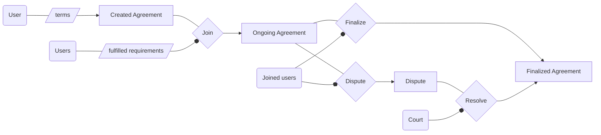

# Agreement lifecycle

## Agreement creation & joining

To create an agreement, you first need to define the terms of the agreement. This includes:

- Detailed human-readable details on the rights & obligations of the parties.
- Requirements to join the agreement.
- Any additional parameter required by the framework of the agreement.

The terms' details can be kept private. The only thing that will be written on-chain is cryptographic proof of the terms so other parties can verify them when needed and the parameters required on-chain for the operations of the agreement.

Joining an agreement is as simple as signing the transaction to join and fulfilling the requirements to join. In most cases, it means providing some assets as collateral to guarantee the enforceability of the terms. 

When those assets are deposited in the agreement, they become part of the system's jurisdiction and are only governable under the terms of the contract.

Each agreement use-case will rely on its operational procedures to keep the rights & obligations among its parties in order.

For example, in the case of a payment escrow, the same smart contract that governs the agreement can implement the transfer of funds between the parties.

## Agreement finalization

Each [agreement framework](./architecture#agreement-framework) will define specific finalization requirements. Once those requirements are met, the agreement's enforceability will end, and the parties will be free of their contractual obligations.

For example, a collateral agreement could define that only when all the parties consent to finalize the agreement can they recover their deposited collateral.

## Dispute creation & resolution

Any of the parties involved can dispute the agreement in Court. When disputed, the parties involved will need to provide allegations & evidence, in most cases making the terms of the agreement accessible to the jurors resolving the dispute.

After reviewing the allegations & evidence, the jurors will have to reach a consensus on a fair settlement for the agreement. That settlement can include punishments to some parties involved through their deposited collateral.

To do so, the Court will submit a resolution with the consensus of the jurors. Each submitted resolution will go through a hold period during which any party involved can appeal the resolution, preventing it from being executable. The DAO can override an appeal if there is a lack of valid evidence of misjudgment in the resolution submitted by the Court.

To incentivize avoiding disputes, creating disputes and appeals will have a cost. These fees will also be used to cover the operational costs of the arbitration system.

When a resolution is not appealable anymore, anyone can execute the submitted resolution, and once the dispute is settled, the agreement will be automatically finalized.
