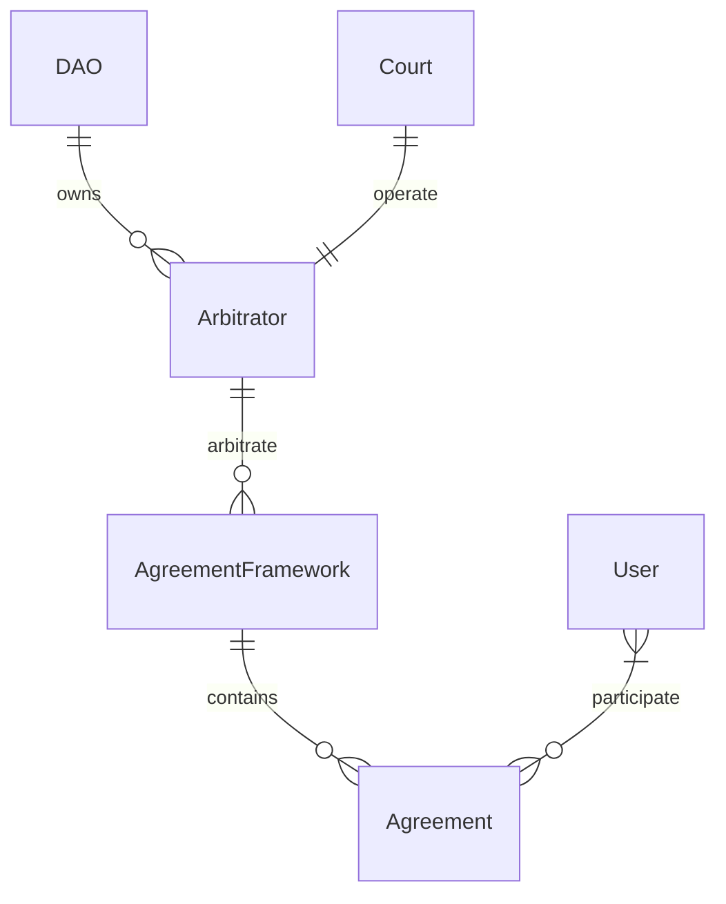

# Architecture

- [Architecture](#architecture)
  - [Agreement framework](#agreement-framework)
  - [Arbitrator](#arbitrator)
  - [Court](#court)

## Agreement framework

Most agreements will be managed by a use-case-specific solidity framework defining a standard creation, governance, dispute & resolution logic between similar agreements. These frameworks can be implemented as Clone (proxy) factories or complex storage contracts.

Examples of arbitrable contracts use-cases that we can expect in the system:

- Collateral vaults
- Conditioned payment escrows
- Collateralized soulbound tokens
- ...

## Arbitrator

A smart contract owned by Nation3 and controlled by the Court with the power to settle disputes in arbitrable agreements.

The Arbitrator defines the rules of the arbitration process, such as the requirements to submit, execute, appeal or endorse resolutions.

It will also be responsible for capturing system fees.

## Court

The Court is expected to be a multi-sig account with the jurors as signers that can submit resolutions to the Arbitrator.